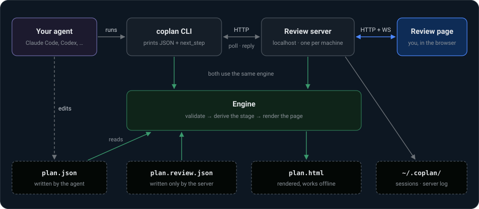

# Coplan

Plan your next feature with a rich HTML planning experience.

https://github.com/user-attachments/assets/0d469189-1530-4830-93c8-8cf0da82f183

## Install

Coplan runs locally on your machine and needs Node.js 24+.
It has two parts: the `coplan` command, and a skill that tells your agent when and how to use it.
Install either of these ways:

### Claude Code

Install the plugin, which brings the skill and the command together:

```
/plugin marketplace add mitchglenn/coplan
/plugin install coplan@coplan
```

### Codex, Cursor, Gemini CLI, GitHub Copilot, OpenCode and Amp

Install the command from a clone you keep, then let it install the skill for the agents it finds:

```sh
git clone https://github.com/mitchglenn/coplan && cd coplan
npm install && npm link
coplan setup
```

`coplan setup` writes the skill to `~/.agents/skills` and to `~/.claude/skills` when Claude Code is installed, so this also works for Claude Code without the plugin.
To upgrade, run `git pull` in the clone and `coplan setup` again.
`coplan setup --remove` takes the skill out.

## Use it

In your project, ask your agent to use coplan:

> Let's work on adding a new feature for team invites, use coplan.

From there:

1. **The agent asks the questions that matter first.**
   It drafts a handful of key decisions
2. **You answer the ones you care about.**
   The decisions open in your browser as a short questionnaire. Answering questions is optional.
3. **The agent writes the plan.**
   An overview, flows as sequence diagrams, the core concepts, edge cases and security risks by priority.
4. **You review it like a document you can talk to.**
   Hover anything to comment, select text to quote it, skip edge cases that do not matter, and answer the agent's open questions, then send.
   The agent revises the plan, and the page updates by itself.
5. **You approve, and choose what comes next.**
   Have the agent break the plan into vertical slices and tasks that can be synced to systems like Jira, or skip that and build it now.

While you review, the agent waits for you: the review page is the conversation until you approve or end the review.
Plans live in your project under `.coplan/<name>/`.
Commit them to keep each plan and its approvals next to the code, or add `.coplan/` to `.gitignore`.

## How it works



The agent never talks to you through the page.
It edits `plan.json` and runs `coplan` commands, and your side of the conversation reaches it as JSON with the next step spelled out.
That is why any agent that can run a command can use Coplan, with no special integration.

Next to each `plan.json`, Coplan keeps:

| File               | Writer | Holds                                                                                                      |
| ------------------ | ------ | ---------------------------------------------------------------------------------------------------------- |
| `plan.json`        | Agent  | The plan: title, summary, key decisions, tabs, open questions and slices                                   |
| `plan.review.json` | Server | Your decision answers, approvals and skips, feedback the agent has not picked up yet, and the conversation |
| `plan.html`        | Coplan | The rendered plan: one self-contained page that works offline                                              |

## Reference

### The plan

A plan is built from typed tabs, so every plan has the same shape and every item in it is something you can comment on:

- `overview` (required): the problem today, the change, goals, out of scope, and what the codebase says.
- `flows`: sequence diagrams drawn from structured steps, with the state each flow creates, updates and reads.
- `concepts`: entities with their rules and constraints.
- `edge_cases` and `security`: grouped by priority.
  You can skip any item, or any gap, that the plan does not need to address; the skip is saved at once and the agent plans no work for it.
- `gaps`: what the plan does not cover yet.
- `custom`: Markdown, callouts, tables, code, and HTML blocks, from static figures to interactive UI mocks.

Open questions get their own tab, and so do slices once you choose to slice an approved plan.
Slices are grouped into waves: slices in one wave do not depend on each other and can be built in parallel.
The full field reference is `coplan guide tabs`.

### Stages

A plan's stage is derived from the plan and the approvals in `plan.review.json`, never declared by the agent.

| Stage           | Meaning                                    | You can                                     |
| --------------- | ------------------------------------------ | ------------------------------------------- |
| `decisions`     | Key decisions are waiting for answers      | Answer any of them, then submit             |
| `drafting`      | Decisions submitted; the agent is writing  | Comment                                     |
| `plan_review`   | The plan is under review                   | Comment, answer questions, approve the plan |
| `slicing`       | Plan approved; the agent is writing slices | Comment                                     |
| `slices_review` | Slices and tasks are under review          | Comment, approve the slices                 |
| `approved`      | Approved to build; the review is closed    | Read                                        |

A plan reaches `approved` when its slices are approved, or when you approve the plan to build now.
You cannot approve while open questions remain: answer them, and the agent folds your answers into the plan first.

### CLI

| Command                     | What it does                                                                  |
| --------------------------- | ----------------------------------------------------------------------------- |
| `coplan`                    | Workflow, rules, commands and open reviews                                    |
| `coplan setup`              | Install the skill for the agents on this machine (`--remove` to take it out)  |
| `coplan guide [topic]`      | Authoring guidance: `workflow`, `decisions`, `plan`, `tabs`, `slices`         |
| `coplan new <slug>`         | Scaffold `.coplan/<slug>/plan.json` with a first decision to fill in          |
| `coplan render <plan.json>` | Validate, write `plan.html`, report errors, warnings and reading time         |
| `coplan open <plan.json>`   | Render, start the server if needed, open the review (`--no-open`, `--reopen`) |
| `coplan poll <plan.json>`   | Wait up to 8 minutes for feedback, else answer `waiting`                      |
| `coplan status <plan.json>` | Stage, approvals and undelivered feedback                                     |
| `coplan end <plan.json>`    | End the review as the agent                                                   |
| `coplan stop`               | Stop the background server                                                    |

`coplan poll` also takes `--reply <text>` or `--reply-file <path or ->` to answer the reviewer first, and `--timeout <seconds>` to wait less.

### Environment

| Variable           | Default     | Purpose                                |
| ------------------ | ----------- | -------------------------------------- |
| `COPLAN_PORT`      | `4455`      | Server port, bound to `127.0.0.1` only |
| `COPLAN_STATE_DIR` | `~/.coplan` | Session registry and server log        |
| `COPLAN_DEBUG`     | unset       | `1` prints stack traces for bugs       |

## Development

```sh
git clone https://github.com/mitchglenn/coplan && cd coplan
npm install
npm link            # puts this checkout's `coplan` on your PATH
coplan setup     # installs the skill for your agents
```

Coplan is written in TypeScript.
A checkout runs the source directly through Node's type stripping, so there is no build step while developing: edit a file and the next command uses it, restarting the background server if it is running older code.

```sh
npm run check       # lint, format check, typecheck, tests
npm test
npm run build       # compile to dist/, which is what an installed package runs
```

`AGENTS.md` describes the architecture.

## Background

Coplan takes the best parts of [Alder](https://getalder.com), a planning product, and open-sources them.
Its agent loop, where the agent opens a page for you to comment on and your feedback comes back to it through a CLI, was inspired by [lavish-axi](https://github.com/kunchenguid/lavish-axi).

## License

[MIT](LICENSE)
